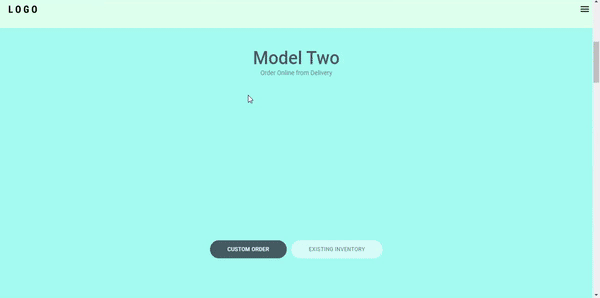
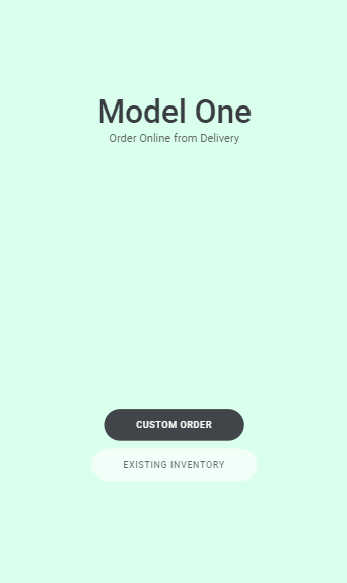

<div align="center">
  
</div>

<br />

# Tesla Clone
  A clone of Tesla animations written in React, using framer motion to made the animations.


## Techologies
- React
- Typescript
- Framer Motion
- styled-components

## How to run

```
# Clone repository

git clone https://github.com/r3nanp/tesla-clone.git
```

```
# At the root of the project, run:

yarn or npm install
```

```
# To run the app in your machine:

yarn start
```

## Screenshots
  

### Site
[Tesla Clone](https://r3nanp-tesla-clone.netlify.app/)
